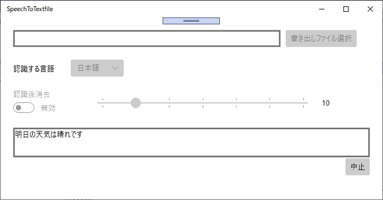
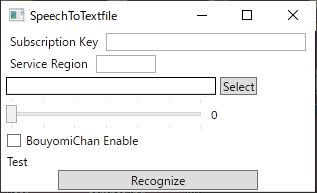

title: 音声認識格闘録
class: animation-fade
layout: true

<!-- This slide will serve as the base layout for all your slides -->
.bottom-bar[
  {{title}}
]

---

class: impact

# {{title}}
## もしくはUWPに敗北した記録
???
- 配信プロファイルは正しいか
- プレゼンを表示している画面にアプリが写りこまないようにしているか
- 音声認識アプリは起動しているか
- 3teneは起動しているか、3teneのポーズ補正はしたか
- 音声読み上げソフトは起動しているか
- 3teneの画像は非表示になっているか
- 音声認識は切ってあるか
- 人間の声を出すシーンになっているか

---

# 自己紹介

- 「ふぃるみすと」といいます。
- たまに「ふぃるちゃんねる」という名前で昼間に配信をしています。
- プログラムを作った経験はあんまりありません。
- C#で作った経験はもっとありません。
- UWPアプリを作った経験は皆無です。

---

# 動機

## かわいい声になりたくて

最近Vの者が流行ってますね。かわいくなりたいですね。
かわいい声で配信したいですね。

???
つまりバーチャル美少女受肉したいですねということです。

--

## 方法は数あれど

大きくわけて2つの方法があります。
--

- ボイスチェンジャー的なもので声を変換する(例:まぐろなさん)

--
- 音声を文字に変換してから文字を読み上げる(例:のらきゃっとさん)

2つ目の方法は **ゆかりネット** の登場で普及しました。

---

# 音声認識からの読み上げ

## ゆかりネット

ゆかりネットはChromeを経由して音声を文字に変換します。

--

つまり**Chromeがないと音声認識できない**ということです。

???
Web APIについて軽く触れる。

- 他にもChrome経由で音声認識するソフトがある。
- Web APIで音声認識するけれど、対応しているのはChromeだけ。

--

宗教上の理由でChromeを使いたくない人(私)は
使えません。

--

## 他の方法
--

Windows 10の機能のひとつになっている音声認識が使えそうです。

---

name: how-to-write-text

# どうやって配信にのせようか

--

## OBSに文字をのせる方法

1. テキストソース(ファイルから読み込み)
2. ブラウザソース(nodejsか何かでhtmlを表示させる)
3. OBSのWebSocketプラグインでソースを操作

???
それぞれの利点と欠点を説明する。

- テキストソースはファイルに書きこむだけなので扱いが楽だけれど凝ったことは出来ない。
- ブラウザソースは柔軟な表示ができるけれど負荷がかかる。
- WebSocketプラグインでの操作はOBSの設定に依存するし凝ったことは出来ない。

--

テキストソースを使うのが実装する上では一番楽です。

---

template: how-to-write-text

## 音声認識をするアプリを作る

Windows 10で音声認識をする場合、
標準の音声認識機能を使うにはUWPアプリを作らないといけません。

具体的に言うとUWPアプリからWinRT APIというものを使うことになります。

???
UWPに関連してWinRT APIについて説明する。

- Windows 8のあたりからWinRT APIが導入された。
- 音声認識するにはWinRT APIを使わなくてはならない。
- WinRT APIは基本的にUWPアプリでしか使えない。

--

UWPアプリは作ったことがないので作り方を調べるところから始めました。

---

template: how-to-write-text

## UWPアプリの作り方

流れとしては:

1. 画面をXAMLで作る
2. XAMLに対応したコードを作る

XAMLはXMLで書かれた画面記述用の言語です。

Visual Studioで作る場合、実際に表示される画面を見ながら作成できます。

---

name: UWP-App-created
exclude: false

# UWPアプリを作る

---

template: UWP-App-created

## 襲いかかるC#とUWPの仕様

- eventって何？
- async voidとasync Taskの違いって？
- 直接画面に値を書きこめないの？　UIスレッドっておいしい？
- バックグラウンドでタスクまわしっぱなしってできるの？

---

template: UWP-App-created

## なんやかんやで

ながくくるしいたたかいだった。

.center[]

---

template: UWP-App-created

## 問題点

--

アプリがバックグラウンドになると音声認識を停止してしまう。

- UWPアプリはバックグラウンドになると停止状態になる。

参考: https://docs.microsoft.com/en-us/windows/uwp/launch-resume/app-lifecycle

どうして(猫略)

---

template: UWP-App-created

## UWPアプリ以外でもWindows 10の音声認識を使いたい

- Windows 10の音声認識は通常のアプリでも使えます。
- アプリをMSIXパッケージにして、固有のidentityをつけるとWindows 10の音声認識が呼びだせるようになります。

--

## Windows 10の音声認識をWPFアプリから使った

結果:
- 音声認識は通常のアプリでもバックグラウンドになると停止する。
- APIの使用に制限がかかっているのかも。

???
*でも他のアプリで音声認識できているのもあるんだよね……*

時間的にこれらの問題を正面から解決するのはあきらめました。

---

name: App-Final

# 最終的にどうしたか

--

## Microsoft AzureのSpeech To Textを使う

- Azureの音声認識サービスを使えばとりあえず認識できるでしょう。
- 無料枠が少しだけあるので試すのは簡単です。

---

template: App-Final

## 一週間でできました。

--

.center[]

かなり雑に作ったし、コードを流用できたから……

- ファイルの更新検知では読み上げが上手くいかなかったので、棒読みちゃん付属のソースを使いました。

???
雑に作った部分を説明する。

- UIの表示が雑。
- エラー処理はほぼしていない。
- マルチスレッドはよくわからなかった。

上手くいかなかった部分を説明する。

- 当初はコマンドラインから読みあげさせる予定だった。
- 更新検知のスクリプトを組むと2度検知されることがあった。
- Socket通信も面倒だったのでIPCで通信している。

---

template: App-Final

## そして

---

class: impact

## かわいくなりました。

???
- 棒読みちゃんへの接続を確認する。
- 音声認識を有効化する。
- かわいくなるシーンに切りかえる。
- ここから聞きづらくなることを言う。

---

template: App-Final

## 問題点

- 自分の声以外がマイクに入ると認識率が格段に落ちます。
- 認識完了してから表示させるので、どうしてもラグが存在します。
- 声を出していない時間も含めて課金対象になります。
- 標準の状態では思っていたより認識精度が出ません。

単一指向性のマイクを使うなどして、
自分の声以外の音が入らない環境を作るのが大前提になります。

その上でさまざまな余裕がある場合、
自分で学習させてカスタムされたモデルを使うことが認識精度の向上につながります。

???
お金とか時間の余裕はなかったので学習はさせていません。

---

template: App-Final
name: Price

## 価格

---

template: Price

### Azure Speech Services (Microsoft)

- 無料プラン: 月に5時間まで (一応カスタムも可能)
- 標準プラン: 1時間あたり1.00USD、無料枠なし
- 標準カスタム: 1時間あたり1.40USD + エンドポイント1つあたり0.0538USD毎時(1か月39USDくらい)

ドキュメントを読む限り、クラウド主要3社の中では一番Windowsにおいて使いやすいと思います。

追加で語句を認識させたいとかノイズの多い環境に合わせたいときは、
自分でデータを用意して学習させる必要があります。

???
使いやすい点について説明する。

- C#のSDKはWindowsだとコードを書く量がとても少なくて済む。
- マイクからストリーム持ってきてとか書かなくていい。

学習の詳細について軽く説明する。

1. 実際に使われる文章をテキストファイルにして流しこむ方法。用途に特化した学習ができる。
2. 使用される環境で話した文と対応したテキストを流しこむ方法。1つの文ごとに区切る必要がある。認識間違いを減らす効果がある。

---

template: Price

### Google Cloud Speech To Text (Google)

- 標準モデル: 月に60分までは無料、それ以上は15秒あたり0.006USD(1時間あたり1.44USD)
- Googleにデータの利用を許可すると15秒あたり0.004USD(1時間あたり0.96USD)に割引
- 料金はリクエストごとに15秒単位へ切り上げ

言葉が豊富でノイズにも対応できるという売り文句です。

自分で単語を追加するのは無理そうです。

???

- Googleに協力すると割引されるあたりが実にGoogleらしい商売の仕方だと思います。

---

template: Price

### Amazon Transcribe (Amazon)

- 1秒あたり0.0004USD(1時間あたり1.44USD)
- 最初に文字起こしをした時から12か月間は、月あたり60分まで無料
- 1リクエストの秒数が15秒未満の場合は15秒に切り上げ

AWSで学習のためにデータを利用するみたいですが、
サポートに問い合わせて削除することも可能なようです。

???

- ドキュメントでしか仕様は見ていません。
- ほぼ強制的にデータを使われると言ってもいいでしょう。

---

template: Price

### 補足

有料でいいなら他にも音声認識サービスはあります。

- IBM Watson
- AmiVoice

いろいろ！

オフラインで認識したいならJulius( https://github.com/julius-speech/julius )が使えるかもしれません。

---

name: kawaii

# かわいくなるための補足

--

## Vの者といえば絵が必要ですよね

絵を動かすソフトはいくつかあります。

* facerig
>Steamで買えるとっても有名なソフト。
>Live2Dな絵を動かす人が多い。

* VRMを動かせるソフト
> 3tene、VDRAW、VMagicMirror、バーチャルモーションキャプチャー

???
おそらくすぐに思い浮かぶのがfacerig。

---

template: kawaii

## VRMって何ですか？

https://vrm.dev/

>「VRM」はVRアプリケーション向けの人型3Dアバター（3Dモデル）データを扱うためのファイルフォーマットです。glTF2.0をベースとしており、誰でも自由に利用することができます。

- 主にニコニ立体(ニワンゴ)とかVRoid Hub(Pixiv)、booth(Pixiv)で配布されている。
- 人型モデルをUnityで使う形式に変換できればそこから作れる(UniVRM)。

VRM FANBOOK(m2wasabiさん著)に詳しく載っています。

https://booth.pm/ja/items/1037223

???
VRM FANBOOKのところをboothに出ている本と言いかえる。

---

template: kawaii

## リップシンク

文字表示と同時に口を動かすのは難しいですが、
合成した音声に合わせて口を動かすのはなんとかなります。

1. VB-CABLE( https://www.vb-audio.com/Cable/ )を入れて、仮想オーディオデバイスを作ります。
2. VOICEROID2の出力先をVB-CABLE Inputに設定します。
3. VB-CABLE Inputをデバイスの設定から「スピーカーで聞く」ように設定します。
4. リップシンクできるソフトの入力をVB-CABLE Outputに設定します。

同じところが出しているVoicemeeter Bananaでもなんとかなると思います。

???
簡単に言うと、
合成音声を仮想オーディオデバイスに出力して、
デスクトップの音と混じらない出力だけをリップシンクするソフトが聞くようにするということです。

---

# まとめ

- 実質100行に満たないコードを書けば済むくらいに今の音声認識は楽でした。
- GUIアプリを作るのもとても楽になりました。
- Googleに屈さなくても方法はあるよ。
- でも素直にGoogleのを使うほうが精度いいんですよね。

今回使ったプログラムのソースコードはそのうち公開するかもしれません。

---

# 謝辞

- 自分の声を出さずに配信できると知ったのはすまいるさんの配信を見たからです。
- MicrosoftのUWP音声認識サンプル( https://github.com/Microsoft/Windows-universal-samples/tree/master/Samples/SpeechRecognitionAndSynthesis )で最初の一歩を踏み出しました。
- 棒読みちゃんがあったからこそ声を出すことができました。
- VOICEROID2:琴葉葵で合成音声を出力しています。
- 3Dモデルは金子卵黄さんの「まんぞく葵ちゃんVRM(袖なし)」( https://3d.nicovideo.jp/works/td35206 )を使っています。
- フェイシャルキャプチャソフトは3tene(株式会社プラスプラス)を使っています。
- 配信のノウハウを築いてきた先人に感謝します。
- YPv6( http://ypv6.pecastation.org/ )いいよね。みんなもIPv6にしよう？

???
認識精度に配慮して置きかえる。

- 自分の声を出さずに配信できるとしったのは、すまいるさんの配信を見たからです。
- Microsoftのサンプルで最初の一歩を踏み出しました。
- 棒読みちゃん、ボイスロイドがあったからこそ声を出すことができました。
- 固有名詞の関係で文字にできませんが、このプレゼンをするために今画面へ出ているものを使っています。
- IPv6で配信を出しています。みんなも使いましょう。
- 発表は以上です、何か質問があれば掲示板の方にどうぞ。
